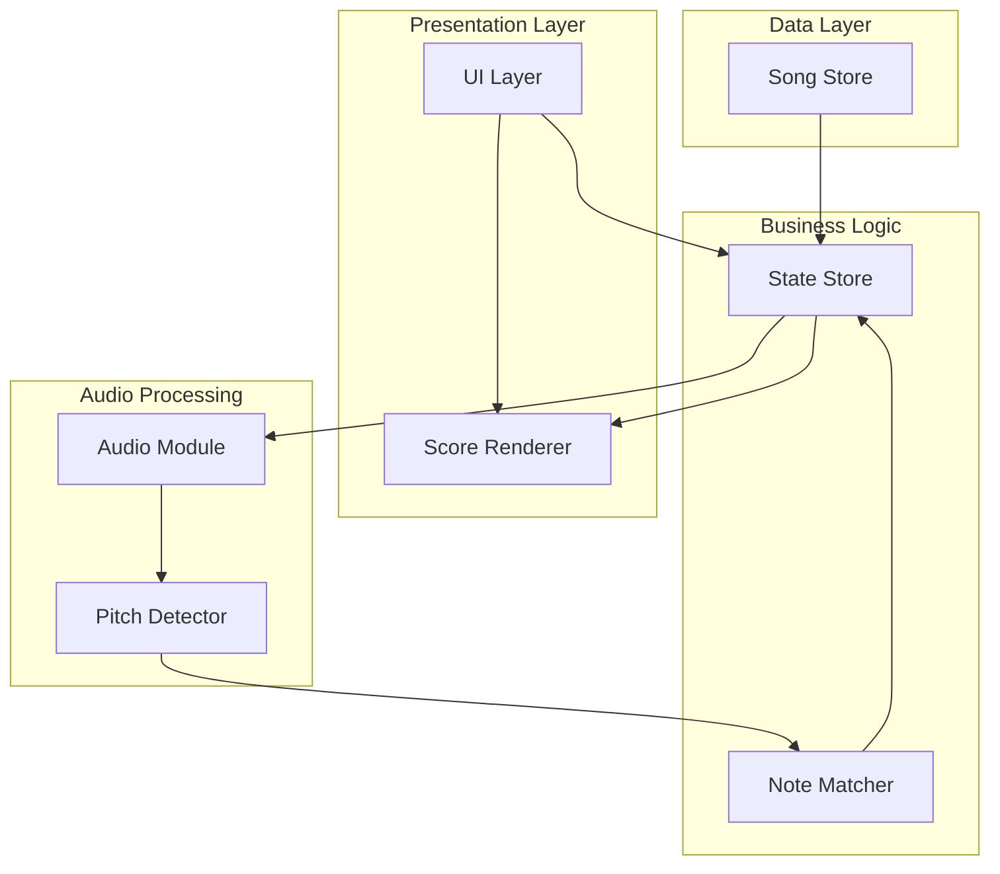
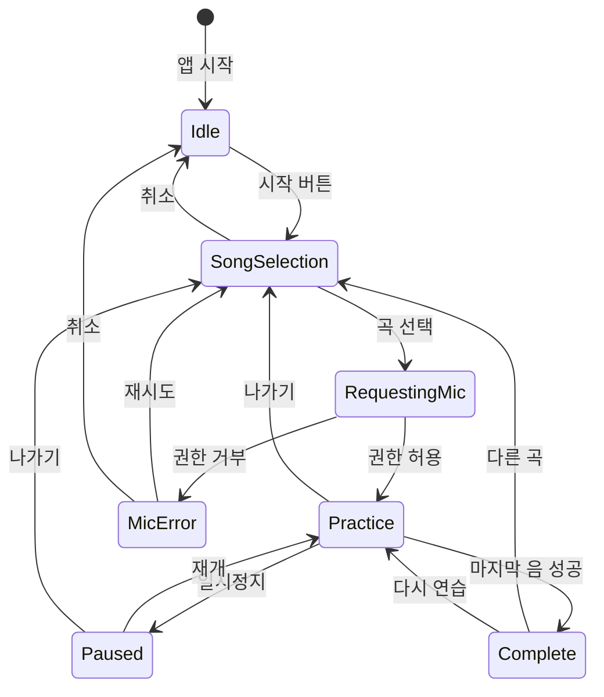
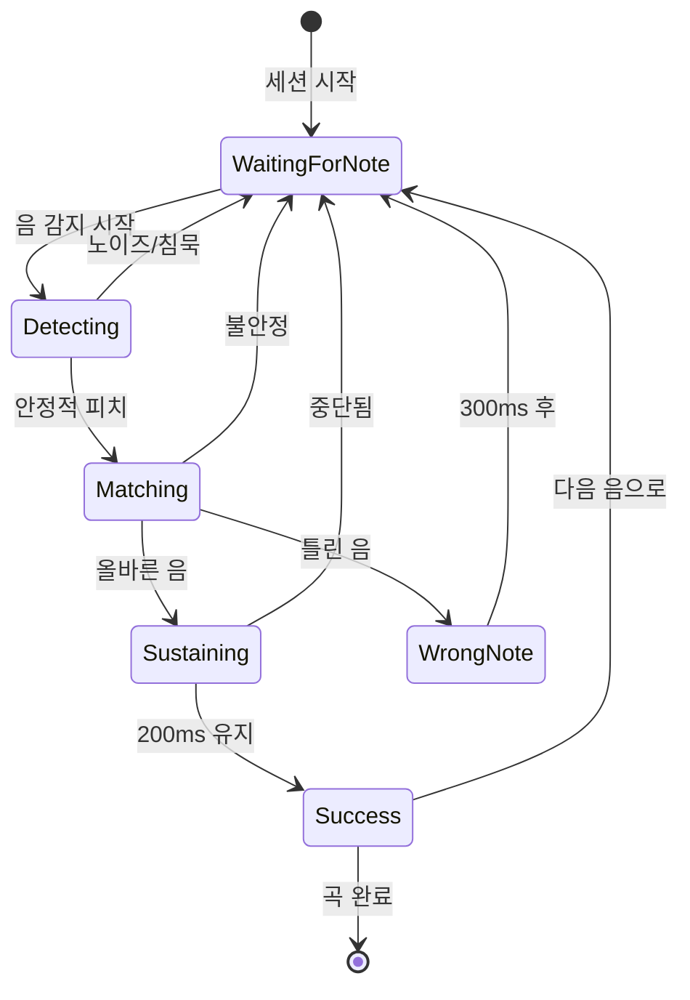
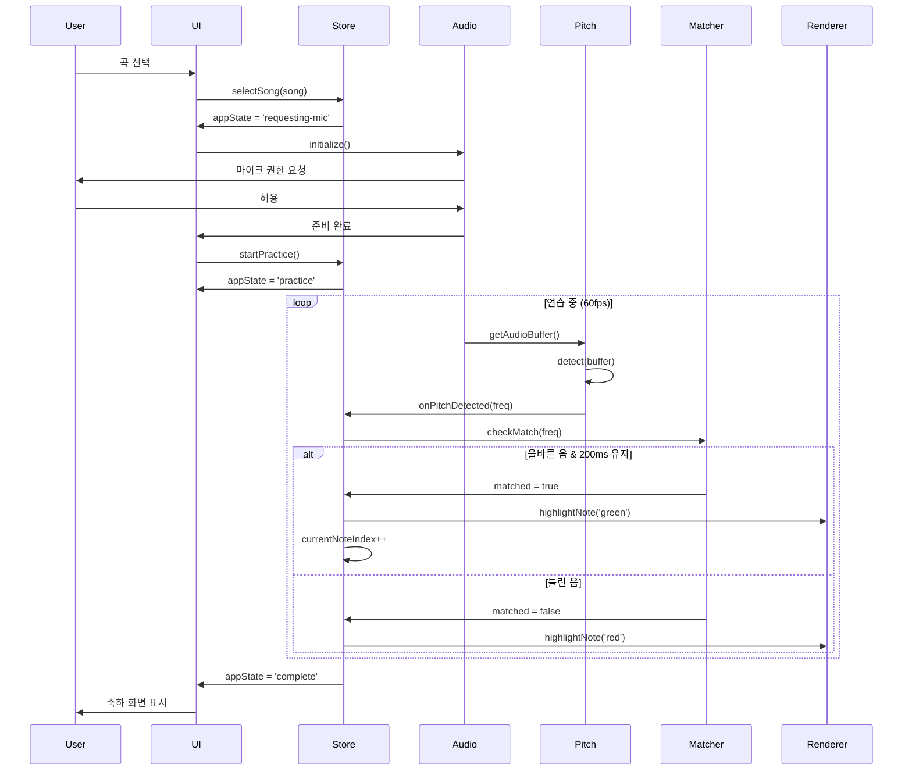

# 시스템 아키텍처

## 1. 전체 시스템 개요

피아노 멜로디 연습 앱은 브라우저 기반 클라이언트 사이드 애플리케이션으로, 백엔드 서버 없이 완전히 프론트엔드에서 동작합니다.

```
┌─────────────────────────────────────────────────────────┐
│                     Browser Environment                  │
│                                                          │
│  ┌────────────────────────────────────────────────┐    │
│  │            React Application                    │    │
│  │                                                 │    │
│  │  ┌──────────┐  ┌──────────┐  ┌──────────┐    │    │
│  │  │   UI     │  │  State   │  │  Audio   │    │    │
│  │  │Components│◄─┤Management├─►│ Pipeline │    │    │
│  │  └──────────┘  └──────────┘  └──────────┘    │    │
│  │                                                 │    │
│  └────────────────────────────────────────────────┘    │
│                                                          │
│  ┌────────────────────────────────────────────────┐    │
│  │         Web Audio API + Browser APIs           │    │
│  │  • AudioContext  • MediaStream  • Storage      │    │
│  └────────────────────────────────────────────────┘    │
│                                                          │
└─────────────────────────────────────────────────────────┘
                          │
                          ▼
                 ┌────────────────┐
                 │  Microphone    │
                 │  (실제 피아노)   │
                 └────────────────┘
```

## 2. 모듈 구조

### 2.1 핵심 모듈 다이어그램



### 2.2 모듈 상세 설명

#### 2.2.1 AudioCapture Module

**책임**: 마이크 입력 캡처 및 오디오 스트림 관리

```typescript
// src/modules/audio/AudioCapture.ts

export class AudioCapture {
  private audioContext: AudioContext | null = null;
  private mediaStream: MediaStream | null = null;
  private analyser: AnalyserNode | null = null;
  private sourceNode: MediaStreamAudioSourceNode | null = null;
  
  async initialize(): Promise<void> {
    // 마이크 권한 요청
    this.mediaStream = await navigator.mediaDevices.getUserMedia({
      audio: {
        echoCancellation: false,
        noiseSuppression: false,
        autoGainControl: false,
        sampleRate: 44100
      }
    });
    
    // AudioContext 생성
    this.audioContext = new AudioContext({ sampleRate: 44100 });
    this.sourceNode = this.audioContext.createMediaStreamSource(this.mediaStream);
    
    // AnalyserNode 설정
    this.analyser = this.audioContext.createAnalyser();
    this.analyser.fftSize = 2048;
    this.analyser.smoothingTimeConstant = 0.8;
    
    this.sourceNode.connect(this.analyser);
  }
  
  getAudioBuffer(): Float32Array {
    if (!this.analyser) throw new Error('Not initialized');
    const buffer = new Float32Array(this.analyser.fftSize);
    this.analyser.getFloatTimeDomainData(buffer);
    return buffer;
  }
  
  async suspend(): Promise<void> {
    await this.audioContext?.suspend();
  }
  
  async resume(): Promise<void> {
    await this.audioContext?.resume();
  }
  
  cleanup(): void {
    this.mediaStream?.getTracks().forEach(track => track.stop());
    this.audioContext?.close();
  }
}
```

**의존성**: Web Audio API, MediaStream API

---

#### 2.2.2 PitchDetector Module

**책임**: 오디오 버퍼에서 주파수 감지

```typescript
// src/modules/audio/PitchDetector.ts

import PitchFinder from 'pitchfinder';

export interface PitchDetectionConfig {
  sampleRate: number;
  threshold: number;
  analysisInterval: number;
  noiseGate: number;
}

export interface PitchDetectionResult {
  frequency: number | null;
  clarity: number;  // 0-1, 신뢰도
  timestamp: number;
}

export class PitchDetector {
  private detectPitch: (buffer: Float32Array) => number | null;
  private config: PitchDetectionConfig;
  private lastDetectionTime = 0;
  
  constructor(config: PitchDetectionConfig) {
    this.config = config;
    this.detectPitch = PitchFinder.YIN({
      sampleRate: config.sampleRate,
      threshold: config.threshold
    });
  }
  
  detect(audioBuffer: Float32Array): PitchDetectionResult | null {
    const now = Date.now();
    if (now - this.lastDetectionTime < this.config.analysisInterval) {
      return null;  // 분석 간격 제한
    }
    this.lastDetectionTime = now;
    
    // 볼륨 체크 (노이즈 게이트)
    const rms = this.calculateRMS(audioBuffer);
    if (rms < this.dbToLinear(this.config.noiseGate)) {
      return { frequency: null, clarity: 0, timestamp: now };
    }
    
    const frequency = this.detectPitch(audioBuffer);
    
    return {
      frequency,
      clarity: frequency ? this.calculateClarity(audioBuffer, frequency) : 0,
      timestamp: now
    };
  }
  
  private calculateRMS(buffer: Float32Array): number {
    let sum = 0;
    for (let i = 0; i < buffer.length; i++) {
      sum += buffer[i] * buffer[i];
    }
    return Math.sqrt(sum / buffer.length);
  }
  
  private dbToLinear(db: number): number {
    return Math.pow(10, db / 20);
  }
  
  private calculateClarity(buffer: Float32Array, frequency: number): number {
    // YIN 알고리즘의 clarity 메트릭 (간단 버전)
    // 실제 구현은 라이브러리에서 제공하는 값 사용
    return 0.95;  // Placeholder
  }
}
```

**의존성**: pitchfinder 라이브러리

---

#### 2.2.3 NoteMatcher Module

**책임**: 감지된 피치와 목표 음 비교, 매칭 로직

```typescript
// src/modules/game/NoteMatcher.ts

export interface NoteMatchingConfig {
  toleranceCents: number;
  sustainWindowMs: number;
  debounceMs: number;
}

export interface MatchResult {
  matched: boolean;
  targetNote: number;
  detectedNote: number | null;
  centsOff: number | null;
  sustainedMs: number;
}

export class NoteMatcher {
  private config: NoteMatchingConfig;
  private currentTargetNote: number | null = null;
  private matchStartTime: number | null = null;
  private lastMatchTime: number = 0;
  
  constructor(config: NoteMatchingConfig) {
    this.config = config;
  }
  
  setTargetNote(midiNote: number): void {
    this.currentTargetNote = midiNote;
    this.matchStartTime = null;
  }
  
  checkMatch(detectedFrequency: number | null): MatchResult {
    const now = Date.now();
    
    // 디바운스
    if (now - this.lastMatchTime < this.config.debounceMs) {
      return this.createResult(false, 0);
    }
    
    if (!this.currentTargetNote || !detectedFrequency) {
      this.matchStartTime = null;
      return this.createResult(false, 0);
    }
    
    const detectedMidi = this.frequencyToMidi(detectedFrequency);
    const centsOff = this.calculateCentsOff(
      detectedFrequency,
      this.midiToFrequency(this.currentTargetNote)
    );
    
    const isMatch = Math.abs(centsOff) <= this.config.toleranceCents;
    
    if (isMatch) {
      if (!this.matchStartTime) {
        this.matchStartTime = now;
      }
      const sustainedMs = now - this.matchStartTime;
      
      if (sustainedMs >= this.config.sustainWindowMs) {
        this.lastMatchTime = now;
        this.matchStartTime = null;
        return this.createResult(true, sustainedMs, detectedMidi, centsOff);
      }
      
      return this.createResult(false, sustainedMs, detectedMidi, centsOff);
    } else {
      this.matchStartTime = null;
      return this.createResult(false, 0, detectedMidi, centsOff);
    }
  }
  
  private createResult(
    matched: boolean,
    sustainedMs: number,
    detectedNote?: number,
    centsOff?: number
  ): MatchResult {
    return {
      matched,
      targetNote: this.currentTargetNote!,
      detectedNote: detectedNote ?? null,
      centsOff: centsOff ?? null,
      sustainedMs
    };
  }
  
  private frequencyToMidi(frequency: number): number {
    return Math.round(69 + 12 * Math.log2(frequency / 440));
  }
  
  private midiToFrequency(midi: number): number {
    return 440 * Math.pow(2, (midi - 69) / 12);
  }
  
  private calculateCentsOff(detected: number, target: number): number {
    return 1200 * Math.log2(detected / target);
  }
}
```

**의존성**: 없음 (순수 로직)

---

#### 2.2.4 ScoreRenderer Module

**책임**: SVG 악보 렌더링 및 시각적 피드백

```typescript
// src/modules/ui/ScoreRenderer.ts

export interface Note {
  pitch: number;
  duration: number;
}

export interface RenderConfig {
  width: number;
  height: number;
  noteSize: 'small' | 'medium' | 'large';
  showNoteNames: boolean;
}

export class ScoreRenderer {
  private svg: SVGSVGElement;
  private notes: Note[];
  private config: RenderConfig;
  
  constructor(container: HTMLElement, notes: Note[], config: RenderConfig) {
    this.notes = notes;
    this.config = config;
    this.svg = this.createSVG(container);
    this.render();
  }
  
  private createSVG(container: HTMLElement): SVGSVGElement {
    const svg = document.createElementNS('http://www.w3.org/2000/svg', 'svg');
    svg.setAttribute('width', String(this.config.width));
    svg.setAttribute('height', String(this.config.height));
    svg.setAttribute('viewBox', `0 0 ${this.config.width} ${this.config.height}`);
    container.appendChild(svg);
    return svg;
  }
  
  private render(): void {
    // 오선지 그리기
    this.drawStaff();
    
    // 높은음자리표 그리기
    this.drawTrebleClef();
    
    // 음표들 그리기
    this.notes.forEach((note, index) => {
      this.drawNote(note, index);
    });
  }
  
  private drawStaff(): void {
    const staffY = this.config.height / 2;
    const lineSpacing = 15;
    
    for (let i = 0; i < 5; i++) {
      const y = staffY + (i - 2) * lineSpacing;
      const line = document.createElementNS('http://www.w3.org/2000/svg', 'line');
      line.setAttribute('x1', '0');
      line.setAttribute('x2', String(this.config.width));
      line.setAttribute('y1', String(y));
      line.setAttribute('y2', String(y));
      line.setAttribute('stroke', '#000');
      line.setAttribute('stroke-width', '2');
      this.svg.appendChild(line);
    }
  }
  
  private drawTrebleClef(): void {
    // 간단 버전: 텍스트로 표시 (실제는 SVG 패스 또는 이미지)
    const text = document.createElementNS('http://www.w3.org/2000/svg', 'text');
    text.setAttribute('x', '20');
    text.setAttribute('y', String(this.config.height / 2 + 30));
    text.setAttribute('font-size', '60');
    text.setAttribute('font-family', 'serif');
    text.textContent = '𝄞';
    this.svg.appendChild(text);
  }
  
  private drawNote(note: Note, index: number): void {
    const x = 100 + index * 60;  // 음표 간격
    const y = this.getNoteYPosition(note.pitch);
    
    // 음표 머리 (원)
    const noteHead = document.createElementNS('http://www.w3.org/2000/svg', 'ellipse');
    noteHead.setAttribute('cx', String(x));
    noteHead.setAttribute('cy', String(y));
    noteHead.setAttribute('rx', '10');
    noteHead.setAttribute('ry', '8');
    noteHead.setAttribute('fill', '#ccc');  // 기본: 회색
    noteHead.setAttribute('data-note-index', String(index));
    noteHead.classList.add('note-head');
    this.svg.appendChild(noteHead);
    
    // 음표 기둥
    if (note.duration >= 4) {  // 4분음표 이상
      const stem = document.createElementNS('http://www.w3.org/2000/svg', 'line');
      stem.setAttribute('x1', String(x + 10));
      stem.setAttribute('x2', String(x + 10));
      stem.setAttribute('y1', String(y));
      stem.setAttribute('y2', String(y - 35));
      stem.setAttribute('stroke', '#000');
      stem.setAttribute('stroke-width', '2');
      this.svg.appendChild(stem);
    }
    
    // 음이름 표시 (옵션)
    if (this.config.showNoteNames) {
      const noteName = this.midiToNoteName(note.pitch);
      const text = document.createElementNS('http://www.w3.org/2000/svg', 'text');
      text.setAttribute('x', String(x - 8));
      text.setAttribute('y', String(y + 40));
      text.setAttribute('font-size', '12');
      text.setAttribute('fill', '#666');
      text.textContent = noteName;
      this.svg.appendChild(text);
    }
  }
  
  private getNoteYPosition(midiNote: number): number {
    // C4 (60) 기준으로 위치 계산
    const staffCenter = this.config.height / 2;
    const lineSpacing = 7.5;  // 반음 간격
    const offset = (60 - midiNote) * lineSpacing;
    return staffCenter + offset;
  }
  
  private midiToNoteName(midi: number): string {
    const noteNames = ['도', '도#', '레', '레#', '미', '파', '파#', '솔', '솔#', '라', '라#', '시'];
    return noteNames[midi % 12];
  }
  
  highlightNote(index: number, color: 'blue' | 'green' | 'red'): void {
    const noteElement = this.svg.querySelector(`[data-note-index="${index}"]`) as SVGElement;
    if (!noteElement) return;
    
    const colors = {
      blue: '#4A90E2',
      green: '#4CAF50',
      red: '#F44336'
    };
    
    noteElement.setAttribute('fill', colors[color]);
    
    if (color === 'blue') {
      noteElement.setAttribute('stroke', '#1976D2');
      noteElement.setAttribute('stroke-width', '3');
    }
  }
  
  clearHighlight(index: number): void {
    const noteElement = this.svg.querySelector(`[data-note-index="${index}"]`) as SVGElement;
    if (!noteElement) return;
    
    noteElement.setAttribute('fill', '#ccc');
    noteElement.removeAttribute('stroke');
  }
}
```

**의존성**: 없음 (순수 DOM/SVG)

---

#### 2.2.5 SongStore Module

**책임**: 곡 데이터 로딩 및 관리

```typescript
// src/modules/data/SongStore.ts

export interface Song {
  id: string;
  title: string;
  titleKo: string;
  difficulty: 'beginner' | 'easy' | 'medium';
  notes: Note[];
  tempo: number;
  // ... 나머지 필드
}

export class SongStore {
  private songs: Map<string, Song> = new Map();
  
  async loadSongs(): Promise<void> {
    // 동적 import로 곡 데이터 로딩
    const songModules = import.meta.glob('../data/songs/**/*.json');
    
    for (const path in songModules) {
      const song = await songModules[path]() as Song;
      this.songs.set(song.id, song);
    }
  }
  
  getSong(id: string): Song | undefined {
    return this.songs.get(id);
  }
  
  getSongsByDifficulty(difficulty: string): Song[] {
    return Array.from(this.songs.values())
      .filter(song => song.difficulty === difficulty);
  }
  
  getAllSongs(): Song[] {
    return Array.from(this.songs.values());
  }
}
```

**의존성**: Vite의 import.meta.glob

---

## 3. 상태 관리 (State Machine)

### 3.1 애플리케이션 상태 다이어그램



### 3.2 Practice 세션 상세 상태



### 3.3 Zustand 스토어 구조

```typescript
// src/store/appStore.ts

import { create } from 'zustand';

type AppState = 'idle' | 'song-selection' | 'requesting-mic' | 'practice' | 'paused' | 'complete' | 'error';
type PracticeState = 'waiting' | 'detecting' | 'matching' | 'sustaining' | 'success' | 'wrong-note';

interface AppStore {
  // 전역 상태
  appState: AppState;
  
  // 곡 관련
  currentSong: Song | null;
  currentNoteIndex: number;
  
  // 오디오 관련
  isListening: boolean;
  detectedPitch: number | null;
  detectedClarity: number;
  
  // 연습 세션
  practiceState: PracticeState;
  sessionStartTime: number | null;
  correctNotes: number;
  incorrectAttempts: number;
  sustainProgress: number;  // 0-1, 지속 시간 진행률
  
  // 에러
  error: string | null;
  
  // 설정
  settings: {
    toleranceCents: number;
    sustainWindowMs: number;
    showNoteNames: boolean;
    testMode: boolean;
  };
  
  // 액션
  setAppState: (state: AppState) => void;
  selectSong: (song: Song) => void;
  startPractice: () => void;
  pausePractice: () => void;
  resumePractice: () => void;
  exitPractice: () => void;
  
  onPitchDetected: (frequency: number | null, clarity: number) => void;
  onNoteMatched: () => void;
  onWrongNote: () => void;
  advanceToNextNote: () => void;
  
  resetSession: () => void;
  setError: (error: string | null) => void;
  updateSettings: (settings: Partial<AppStore['settings']>) => void;
}

export const useAppStore = create<AppStore>((set, get) => ({
  // 초기 상태
  appState: 'idle',
  currentSong: null,
  currentNoteIndex: 0,
  isListening: false,
  detectedPitch: null,
  detectedClarity: 0,
  practiceState: 'waiting',
  sessionStartTime: null,
  correctNotes: 0,
  incorrectAttempts: 0,
  sustainProgress: 0,
  error: null,
  settings: {
    toleranceCents: 50,
    sustainWindowMs: 200,
    showNoteNames: true,
    testMode: false
  },
  
  // 액션 구현
  setAppState: (appState) => set({ appState }),
  
  selectSong: (song) => set({
    currentSong: song,
    currentNoteIndex: 0,
    appState: 'requesting-mic'
  }),
  
  startPractice: () => set({
    appState: 'practice',
    practiceState: 'waiting',
    sessionStartTime: Date.now(),
    correctNotes: 0,
    incorrectAttempts: 0,
    isListening: true
  }),
  
  pausePractice: () => set({
    appState: 'paused',
    isListening: false
  }),
  
  resumePractice: () => set({
    appState: 'practice',
    isListening: true
  }),
  
  exitPractice: () => set({
    appState: 'song-selection',
    isListening: false,
    currentSong: null,
    currentNoteIndex: 0
  }),
  
  onPitchDetected: (frequency, clarity) => set({
    detectedPitch: frequency,
    detectedClarity: clarity,
    practiceState: frequency ? 'detecting' : 'waiting'
  }),
  
  onNoteMatched: () => {
    const { correctNotes, currentNoteIndex, currentSong } = get();
    const isLastNote = currentSong && currentNoteIndex === currentSong.notes.length - 1;
    
    set({
      practiceState: 'success',
      correctNotes: correctNotes + 1,
      sustainProgress: 1
    });
    
    if (isLastNote) {
      setTimeout(() => set({ appState: 'complete' }), 500);
    } else {
      setTimeout(() => {
        const store = get();
        set({
          currentNoteIndex: store.currentNoteIndex + 1,
          practiceState: 'waiting',
          sustainProgress: 0
        });
      }, 300);
    }
  },
  
  onWrongNote: () => {
    const { incorrectAttempts } = get();
    set({
      practiceState: 'wrong-note',
      incorrectAttempts: incorrectAttempts + 1
    });
    
    setTimeout(() => set({ practiceState: 'waiting' }), 300);
  },
  
  advanceToNextNote: () => {
    const { currentNoteIndex } = get();
    set({
      currentNoteIndex: currentNoteIndex + 1,
      practiceState: 'waiting'
    });
  },
  
  resetSession: () => set({
    currentNoteIndex: 0,
    correctNotes: 0,
    incorrectAttempts: 0,
    sessionStartTime: null,
    sustainProgress: 0
  }),
  
  setError: (error) => set({
    error,
    appState: error ? 'error' : 'idle'
  }),
  
  updateSettings: (newSettings) => set((state) => ({
    settings: { ...state.settings, ...newSettings }
  }))
}));
```

## 4. 컴포넌트 계층 구조

```
App
├─ Header
│  ├─ Logo
│  └─ SettingsButton
│
├─ Router
│  ├─ HomePage
│  │  └─ StartButton
│  │
│  ├─ SongSelectionPage
│  │  ├─ DifficultyTabs
│  │  └─ SongList
│  │     └─ SongCard (여러 개)
│  │
│  ├─ PracticePage
│  │  ├─ SongHeader (제목, 템포)
│  │  ├─ StaffView (악보)
│  │  │  └─ ScoreRenderer
│  │  ├─ PitchIndicator (현재 감지된 음)
│  │  ├─ ProgressBar (진행률)
│  │  └─ ControlPanel
│  │     ├─ PauseButton
│  │     ├─ RestartButton
│  │     └─ ExitButton
│  │
│  ├─ CompletePage
│  │  ├─ Celebration (축하 애니메이션)
│  │  ├─ Statistics (시간, 정확도)
│  │  └─ ActionButtons
│  │     ├─ RetryButton
│  │     └─ NextSongButton
│  │
│  └─ ErrorPage
│     ├─ ErrorMessage
│     └─ RetryButton
│
└─ SettingsModal (조건부)
   ├─ ToleranceSlider
   ├─ NoteNamesToggle
   └─ TestModeToggle
```

## 5. 데이터 흐름

### 5.1 Practice 세션 데이터 흐름

```
1. 사용자 곡 선택
   → SongStore.getSong()
   → AppStore.selectSong()
   → appState: 'requesting-mic'

2. 마이크 권한 요청
   → AudioCapture.initialize()
   → AppStore.startPractice()
   → appState: 'practice'

3. 오디오 처리 루프 (60fps)
   → AudioCapture.getAudioBuffer()
   → PitchDetector.detect()
   → frequency 감지
   → AppStore.onPitchDetected()

4. 음 매칭
   → NoteMatcher.checkMatch(frequency)
   → MatchResult 반환
   
   4a. 매칭 성공
       → AppStore.onNoteMatched()
       → ScoreRenderer.highlightNote(index, 'green')
       → currentNoteIndex++
   
   4b. 틀린 음
       → AppStore.onWrongNote()
       → ScoreRenderer.highlightNote(index, 'red')
       → 300ms 후 재시도

5. 곡 완료
   → appState: 'complete'
   → 통계 계산 및 표시
```

### 5.2 시퀀스 다이어그램



## 6. 성능 고려사항

### 6.1 오디오 처리 최적화

- **requestAnimationFrame 사용**: 브라우저 렌더링 사이클과 동기화
- **버퍼 재사용**: Float32Array 매번 새로 생성하지 않음
- **분석 간격 제한**: 50ms마다 한 번 (20Hz, 충분히 반응적)

```typescript
class AudioLoop {
  private animationId: number | null = null;
  
  start(): void {
    const loop = () => {
      // 오디오 분석
      const buffer = audioCapture.getAudioBuffer();
      const result = pitchDetector.detect(buffer);
      
      if (result) {
        store.onPitchDetected(result.frequency, result.clarity);
      }
      
      this.animationId = requestAnimationFrame(loop);
    };
    
    loop();
  }
  
  stop(): void {
    if (this.animationId) {
      cancelAnimationFrame(this.animationId);
    }
  }
}
```

### 6.2 렌더링 최적화

- **React.memo**: 불필요한 리렌더링 방지
- **CSS transforms**: position/left 대신 transform 사용 (GPU 가속)
- **가상화**: 긴 곡 목록은 react-window 사용

### 6.3 번들 최적화

- **코드 스플리팅**: React.lazy로 페이지별 분리
- **곡 데이터 lazy loading**: 선택 시에만 로드
- **Tree shaking**: 사용하지 않는 코드 제거

```typescript
// 페이지 lazy loading
const PracticePage = lazy(() => import('./pages/PracticePage'));
const CompletePage = lazy(() => import('./pages/CompletePage'));

// 곡 데이터 lazy loading
const loadSong = async (id: string) => {
  const song = await import(`./data/songs/${id}.json`);
  return song.default;
};
```

## 7. 에러 처리 및 복구

### 7.1 에러 타입 및 처리

| 에러 타입 | 원인 | 처리 방법 |
|----------|------|----------|
| `MicPermissionDenied` | 사용자가 권한 거부 | 안내 메시지 + 재시도 버튼 |
| `MicNotFound` | 마이크 없음 | 테스트 모드 제안 |
| `AudioContextFailed` | iOS 제스처 필요 | 사용자 탭 요청 |
| `SongLoadFailed` | 네트워크/파일 오류 | 재시도 + 폴백 곡 |
| `PitchDetectionTimeout` | 5초간 감지 없음 | "피아노를 눌러주세요" 안내 |

### 7.2 에러 바운더리

```typescript
class AudioErrorBoundary extends React.Component {
  state = { hasError: false, error: null };
  
  static getDerivedStateFromError(error: Error) {
    return { hasError: true, error };
  }
  
  componentDidCatch(error: Error, info: React.ErrorInfo) {
    console.error('Audio error:', error, info);
    // 에러 로깅 서비스에 전송 (선택)
  }
  
  render() {
    if (this.state.hasError) {
      return <ErrorPage error={this.state.error} />;
    }
    return this.props.children;
  }
}
```

## 8. 테스트 전략

### 8.1 단위 테스트

```typescript
// PitchDetector.test.ts
describe('PitchDetector', () => {
  it('should detect C4 (261.63 Hz)', () => {
    const detector = new PitchDetector(defaultConfig);
    const buffer = generateSineWave(261.63, 44100, 2048);
    const result = detector.detect(buffer);
    
    expect(result?.frequency).toBeCloseTo(261.63, 0);
  });
  
  it('should return null for silent input', () => {
    const detector = new PitchDetector(defaultConfig);
    const buffer = new Float32Array(2048).fill(0);
    const result = detector.detect(buffer);
    
    expect(result?.frequency).toBeNull();
  });
});

// NoteMatcher.test.ts
describe('NoteMatcher', () => {
  it('should match within tolerance', () => {
    const matcher = new NoteMatcher({ toleranceCents: 50, sustainWindowMs: 200, debounceMs: 100 });
    matcher.setTargetNote(60);  // C4
    
    const result = matcher.checkMatch(265);  // 약간 높은 C4
    expect(result.matched).toBe(false);  // 200ms 미만
    
    // 200ms 후 다시 체크 (실제로는 시간 경과 시뮬레이션)
    jest.advanceTimersByTime(200);
    const result2 = matcher.checkMatch(265);
    expect(result2.matched).toBe(true);
  });
});
```

### 8.2 통합 테스트

```typescript
// Practice session integration test
describe('Practice Session', () => {
  it('should complete a simple song', async () => {
    const { getByText, getByTestId } = render(<App />);
    
    // 곡 선택
    fireEvent.click(getByText('학교 종이 땡땡땡'));
    
    // 마이크 권한 모킹
    mockMediaDevices.getUserMedia.mockResolvedValue(mockStream);
    
    // 연습 시작
    fireEvent.click(getByText('시작'));
    
    // 음 순서대로 시뮬레이션
    const notes = [60, 64, 67];  // 도, 미, 솔
    for (const note of notes) {
      await simulateNote(note, 300);
      await waitFor(() => {
        expect(getByTestId('current-note-index')).toHaveTextContent(String(notes.indexOf(note) + 1));
      });
    }
    
    // 완료 화면 확인
    expect(getByText('완주했습니다!')).toBeInTheDocument();
  });
});
```

### 8.3 E2E 테스트

```typescript
// Playwright E2E test
test('complete practice session', async ({ page }) => {
  await page.goto('http://localhost:5173');
  
  // 곡 선택
  await page.click('text=반짝반짝 작은 별');
  
  // 마이크 권한 허용 (Playwright context에서 미리 설정)
  await page.click('text=시작');
  
  // 테스트 모드 활성화
  await page.click('[data-testid="settings"]');
  await page.check('input[name="testMode"]');
  
  // 가상 키보드로 음 입력
  const notes = ['C4', 'C4', 'G4', 'G4', 'A4', 'A4', 'G4'];
  for (const note of notes) {
    await page.click(`[data-note="${note}"]`);
    await page.waitForTimeout(300);
  }
  
  // 완료 확인
  await expect(page.locator('text=완주했습니다!')).toBeVisible();
});
```

## 9. 배포 아키텍처

```
┌─────────────────────────────────────┐
│         Vercel/Netlify CDN          │
│  (전 세계 엣지 로케이션)              │
└─────────────────────────────────────┘
                  │
                  ├─ index.html
                  ├─ /assets/
                  │  ├─ main.[hash].js
                  │  ├─ vendor.[hash].js
                  │  └─ styles.[hash].css
                  │
                  └─ /data/
                     └─ songs/ (JSON, lazy loaded)

┌─────────────────────────────────────┐
│           GitHub Actions            │
│  (CI/CD 파이프라인)                  │
│  1. Lint & Type check               │
│  2. Unit tests                      │
│  3. Build (Vite)                    │
│  4. Deploy to Vercel                │
└─────────────────────────────────────┘
```

### 9.1 배포 체크리스트

- [ ] HTTPS 활성화 (마이크 접근 필수)
- [ ] PWA manifest 및 service worker
- [ ] 번들 크기 < 500 KB (gzipped)
- [ ] Lighthouse 점수: 90+ (Performance, Accessibility)
- [ ] 브라우저 호환성 테스트 (Chrome, Safari, Edge)
- [ ] 모바일 테스트 (iOS Safari, Android Chrome)
- [ ] 에러 트래킹 설정 (Sentry, 선택)
- [ ] Analytics 설정 (선택)

---

**작성일**: 2026-09-11  
**버전**: 1.0  
**다음 단계**: 프로토타입 구현 시작
